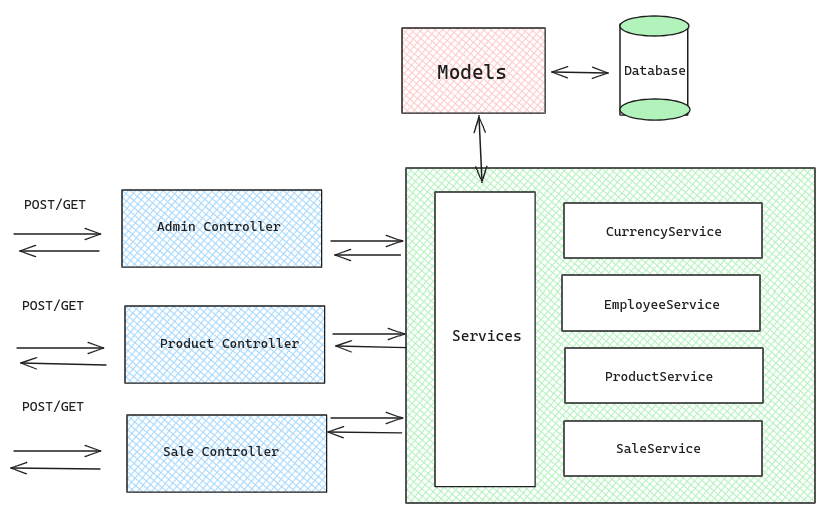
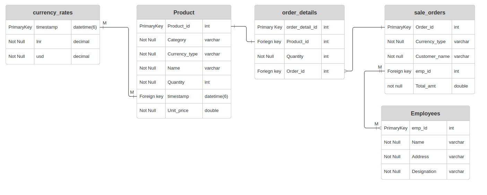

# KiranaStore Backend Service

This backend service provides APIs for managing employees, products, and sale orders in the KiranaStore application.

## System Architecture


## Entity Relationship Model


## System Requirements
Ensure that you have the following prerequisites installed on your system:
- Java 11 or later
- Maven

## How to Run

1. Clone the repository:
```bash
git clone https://github.com/GoutamVerma/Backend-KiranaStore
```
2. Navigate to the project directory:
```bash
cd Backend-KiranaStore
```
3. Open the `src/main/resources/application.properties` file and configure your own database settings:
```bash
spring.jpa.hibernate.ddl-auto=update
spring.datasource.url=jdbc:mysql://your-mysql-host:your-mysql-port/your-database-name
spring.datasource.username=your-username
spring.datasource.password=your-password
spring.datasource.driver-class-name=com.mysql.cj.jdbc.Driver 
```

4. Run the application using Maven:
```bash
mvn spring-boot:run
```

5. Before accessing any API, generate data in tables for employees and products. After that, make sale orders using the provided API endpoints.

The server will start at `localhost:8080`, and you can access the API endpoints as described below.

## Table of Contents (API Endpoints)


- [Admin Controller](#admin-controller)
    - [Add New Employee](#add-new-employee)
    - [Get All Employees](#get-all-employees)
- [Product Controller](#product-controller)
    - [Add New Order](#add-new-order)
    - [Get All Products](#get-all-products)
    - [Filter Products](#filter-products)
- [Sale Controller](#sale-controller)
    - [Create Sale Order](#create-sale-order)
    - [Get All Sale Orders](#get-all-sale-orders)
    - [Filter Sale Orders](#filter-sale-orders)

## Admin Controller

### Add New Employee

- **Endpoint**: `/admin/employee/add`
- **Method**: `POST`
- **Request Parameters**:
    - `name`: Employee name
    - `address`: Employee address
    - `designation`: Employee designation
- **Example Request**:
  ```bash
  curl -X POST http://localhost:8080/admin/employee/add \
       -d "name=John Doe" \
       -d "address=123 Main St" \
       -d "designation=Manager"

### Get All Employees
- **Endpoint**: /admin/employee/all_employee
- **Method**: GET
- **Example Request**:
    ```bash
    curl http://localhost:8080/admin/employee/all_employee

## Product Controller
### Add New Order
- **Endpoint**: /product/order
- **Method**: POST
- **Request Parameters**:
  - **ID**: Product ID
  - **name**: Product name
  - **category**: Product category
  - **qty**: Quantity
  - **unitPrice**: Unit price
  - **currencyType**: Currency type
- **Example Request**:
  ```bash
  curl -X POST http://localhost:8080/product/order \
  -d "ID=1" \
  -d "name=Product A" \
  -d "category=Electronics" \
  -d "qty=10" \
  -d "unitPrice=50.0" \
  -d "currencyType=USD"

### Get All Products
- **Endpoint**: /product/all
- **Method**: GET
- **Example Request**:
  ```bash
  curl http://localhost:8080/product/all

### Filter Products
- **Endpoint**: /product/filter
- **Method**: GET
- **Request Parameters** (Optional):
  - **category**: Product category
  - **id**: Product ID
  - **productName**: Product name
  - **currencyTyp**e: Currency type
  - Example Request:
  ```bash
    curl http://localhost:8080/product/filter?category=Electronics&id=1
  
## Sale Controller
### Create Sale Order
- **Endpoint**: /sale/createOrder 
- **Method**: POST 
- **Example Request**:
```bash
curl -X POST http://localhost:8080/sale/createOrder \
-H "Content-Type: application/json" \
-d '{"orderId": 1, "currencyType": "USD", "customerName": "Customer A", "empId": 2}'
 ```

### Get All Sale Orders
- Endpoint: /sale/all
- Method: GET
- Example Request:
```bash
curl http://your-api-base-url/sale/all
```
### Filter Sale Orders
- **Endpoint**: /sale/filter
- **Method**: GET
- **Request Parameters (Optional)**:
  - **orderId**: Sale order ID
  - **currencyType**: Currency type
  - **customerName**: Customer name
  - **empId**: Employee ID
- Example Request:
```bash
curl http://your-api-base-url/sale/filter?orderId=1&customerName=Customer%20A
```

